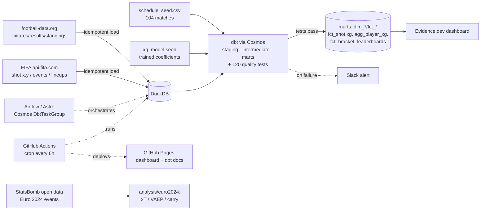

# World Cup 2026 ELT Pipeline

An end-to-end, **live** data platform for the 2026 FIFA World Cup (Jun 11 to Jul 19, 2026).
Airflow (Astro) orchestrates dbt (via Cosmos) into DuckDB; a custom **expected-goals (xG) model**
is trained on FIFA shot coordinates and deployed as pure SQL; and an Evidence.dev dashboard
**auto-refreshes every 6 hours** through the tournament. Everything runs on **free data sources**
and **$0 of hosting**.

## Live

- **Dashboard:** https://aatrey56.github.io/worldcup26-elt/
  (overview, [groups](https://aatrey56.github.io/worldcup26-elt/groups/),
  auto-filling [bracket](https://aatrey56.github.io/worldcup26-elt/bracket/),
  [team leaderboard](https://aatrey56.github.io/worldcup26-elt/leaderboard/),
  [top scorers](https://aatrey56.github.io/worldcup26-elt/scorers/),
  custom-[xG leaderboard](https://aatrey56.github.io/worldcup26-elt/xg/),
  [shot maps](https://aatrey56.github.io/worldcup26-elt/shots/),
  and per-team pages)
- **dbt lineage docs:** https://aatrey56.github.io/worldcup26-elt/dbt-docs/

## Architecture



## The data story (why it is built this way)

Live, event-level football data is one of the most locked-down datasets there is. There is **no
free source of full event data (passes/carries) for WC 2026**, so the project layers what is
genuinely obtainable:

- **football-data.org** (free) is the reliable backbone: fixtures, results, standings.
- **FIFA's own public API** (`api.fifa.com`, free, first-party) is the one free source of **shot
  coordinates** for 2026, plus events, possession, lineups, and top scorers.
- **A custom xG model** is trained offline on FIFA's own 2022 World Cup shots (logistic on shot
  distance + angle; penalties at the empirical conversion rate) and deployed as a **pure-SQL
  scorer** (coefficients live in a dbt seed), so the live pipeline needs no ML runtime. Calibration:
  predicted xG 170.02 vs 170 actual goals, Brier 0.116, ROC-AUC 0.74. Training the model on shot
  coordinates (rather than consuming a vendor's xG) is the modeling showcase.
- **StatsBomb open data** (free, historical) powers a separate, rigorous **player-valuation
  analysis** of Euro 2024 (`analysis/euro2024/`) using xT, out-of-fold VAEP, xGChain, opponent
  adjustment, minutes-weighted empirical-Bayes shrinkage, a separate goalkeeper model, and a "carry"
  score, since the full possession-value methods that 2026 free data cannot support are achievable
  on a completed tournament.

## Data model (DuckDB star schema, dbt)

- **Dimensions:** `dim_team`, `dim_venue`, `dim_match` (104, seeded), `dim_fifa_team`,
  `dim_fifa_player`.
- **Facts:** `fct_result` (incremental, keyed on a stable fixture id), `fct_group_standings`,
  `fct_shot` (per shot, with SQL-scored `xg`), `fct_bracket` (knockout tree that fills as teams
  resolve).
- **Aggregates:** `agg_team_tournament`, `agg_team_leaderboard`, `agg_player_xg` (xG, goals,
  finishing over/under), `agg_team_xg`, `agg_top_scorers`.
- **Quality gate:** 120 dbt tests (generic + dbt_utils + singular), including a 1:1 fixture-to-
  schedule reconciliation, no-double-booking, points reconciliation, and shot-coordinate range
  checks. A failed test fails the run and fires a Slack alert.

## Tech stack

Airflow 3 (Astro Runtime) + astronomer-cosmos, dbt-core + dbt-duckdb, DuckDB, scikit-learn
(offline xG training only), Evidence.dev, GitHub Actions (CI + Pages deploy), ruff + sqlfluff.
For the historical analysis: statsbombpy + socceraction.

## Run locally

Prerequisites: Python 3.12, Node 22+, Docker + the Astro CLI (for local Airflow). A football-data.org
API token in `.env` (`FOOTBALL_DATA_KEY`); FIFA needs no key.

```
make up        # local Airflow (Astro)
make dbt       # dbt seed + run + test
make evidence  # dashboard in dev mode
make lint      # ruff + sqlfluff
# CI runs hermetically on committed sample data (no API key needed)
```

The Euro 2024 analysis is standalone (own venv): `analysis/euro2024/.venv/bin/python
analysis/euro2024/run.py` reproduces its rankings from scratch. See `analysis/euro2024/README.md`
and `ml/README.md`.

## Honest limitations

- **Live xG is verify-on-first-match.** The model is trained on FIFA's verified 2022 (normalized)
  coordinate frame; the live 2026 frame is unconfirmed until the first played match and must be
  re-validated then (the loader flags the metric branch loudly).
- **No xT/VAEP for live 2026** (FIFA's feed has no pass/carry events); those run only on the
  historical StatsBomb analysis.
- **Penalty-shootout winners** are not yet resolved in `fct_bracket` (full-time score only); to be
  wired before the knockout stage.
- The FIFA API is undocumented; the pipeline is defensive (retries, schema tolerance, polite
  caching) and credits FIFA as the source without implying affiliation.

## License

Personal portfolio project. Data: FIFA (api.fifa.com) and football-data.org; historical events from
StatsBomb open data. Not affiliated with FIFA.
