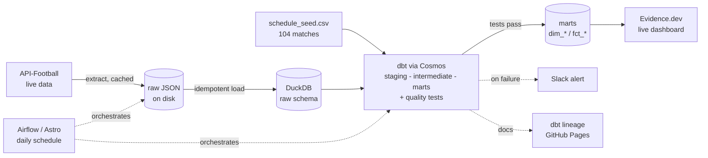

# World Cup 2026 ELT Pipeline

End-to-end ELT for the 2026 FIFA World Cup (Jun 11 to Jul 19, 2026). Airflow (Astro) orchestrates
dbt (via Cosmos) into DuckDB, transforms live fixtures, results, and standings into a tested star
schema, and serves an Evidence.dev dashboard that refreshes daily during the tournament.

> Status: scaffolded. Real build (models, DAG, ingestion, dashboard) pending. See `PLAN.md`.

## Architecture



## Data model (star schema)

- Dimensions: `dim_team`, `dim_venue`, `dim_match` (104 matches, seeded)
- Facts: `fct_result` (incremental), `fct_group_standings`
- Aggregate: `agg_team_tournament`

## Run locally

Prerequisites: Docker, the Astro CLI, Node 22+. See `PLAN.md` Phase 0 for setup.

```
make up        # start local Airflow
make dbt       # dbt seed + run + test
make evidence  # run the dashboard in dev mode
make lint      # ruff + sqlfluff
```

## Links

- Live dashboard: _TBD after deploy_
- dbt docs (lineage): _TBD after deploy_

## License

Personal portfolio project.
